# Architecture

This document describes the complete architecture of the Portfolio project — a full-stack personal portfolio website with a public React frontend, an admin React dashboard, and a layered Express API backed by PostgreSQL via Prisma.

## System Overview

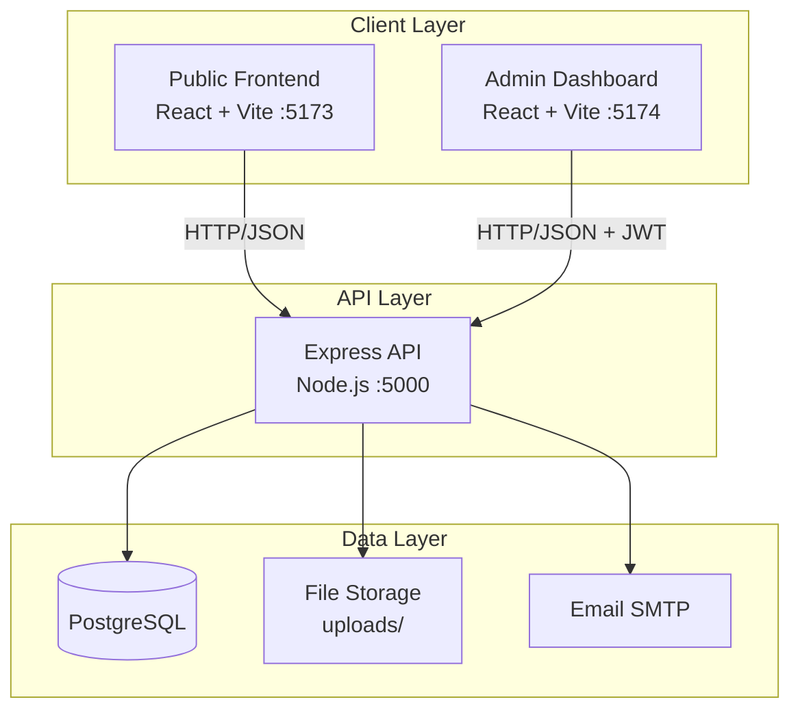

## Request Flow

### Public Request Flow

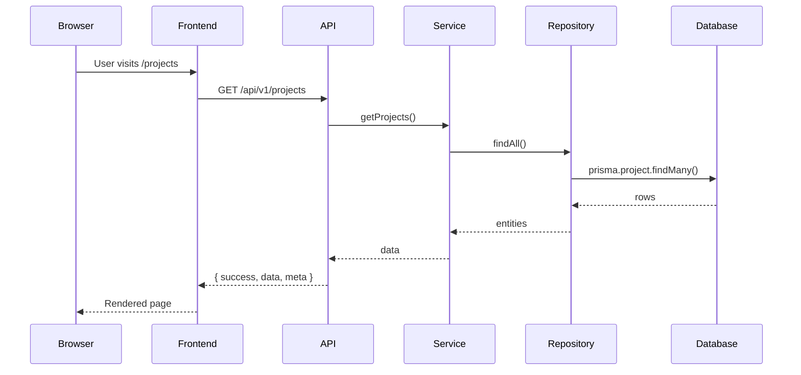

### Authenticated Admin Flow

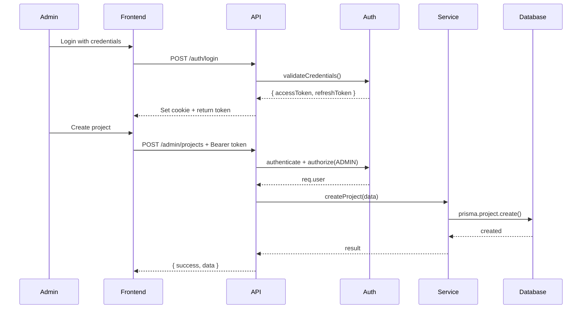

## Backend Layered Architecture

The backend follows a strict layered design. Each layer has a single responsibility and depends only on the layer below it.

```
Request
  → Middleware stack
    → Routes
      → Validators
        → Controllers
          → Services
            → Repositories
              → Database (Prisma / PostgreSQL)
```

### Layer Responsibilities

| Layer | Responsibility | Key Files |
|-------|---------------|-----------|
| `config` | Environment validation, CORS, Helmet, rate-limit | `config/env.js`, `config/cors.js` |
| `constants` | HTTP status codes, error codes, messages | `constants/*.js` |
| `middlewares` | Cross-cutting concerns | `middlewares/*.js` |
| `routes` | URL-to-handler mappings | `routes/v1/*.js` |
| `validators` | Request payload validation | `validators/*.js` |
| `controllers` | HTTP handlers, no business logic | `controllers/*.js` |
| `services` | Business logic | `services/*.js` |
| `repositories` | Data access | `repositories/*.js` |
| `storage` | File storage abstraction | `storage/*.js` |
| `utils` | Shared utilities | `utils/*.js` |

### Key Design Decisions

- **Clean separation of concerns** — Controllers never touch the database; services never read HTTP request/response objects
- **Standardized response envelope** — Every endpoint returns `{ success, message, data, meta }`
- **Centralized error handling** — Single `errorHandler` middleware converts errors into consistent JSON responses
- **Fail-fast configuration** — `config/env.js` validates required environment variables on startup
- **Versioned API** — All endpoints live under `/api/v1` for non-breaking evolution

## Authentication Flow

Authentication uses short-lived access tokens (JWT, in-memory) and long-lived refresh tokens (hashed in database, HttpOnly cookie).

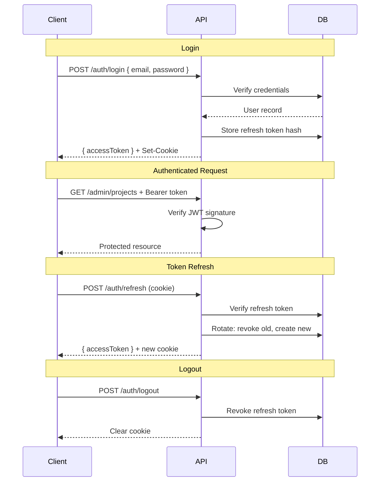

### Security Features

- **Token Rotation**: Refresh tokens are rotated on each use
- **Reuse Detection**: If a revoked token is reused, all tokens for the user are revoked
- **HttpOnly Cookies**: Refresh tokens are inaccessible to JavaScript
- **Role-Based Access**: ADMIN and EDITOR roles gate admin endpoints

## Frontend Architecture

### Public Website

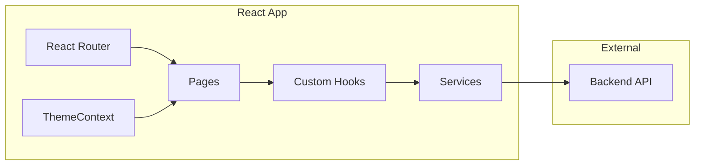

### Key Components

| Component | Purpose |
|-----------|---------|
| `apiClient.js` | HTTP client with caching, retry, timeout |
| `hooks/` | Data fetching hooks (useProjects, useBlogPosts, etc.) |
| `services/` | API service layer |
| `context/ThemeContext.jsx` | Dark/light theme management |
| `components/` | Reusable UI components |
| `pages/` | Route page components |

### Data Flow

1. **Route Change**: React Router renders the appropriate page component
2. **Data Fetching**: Page component calls a custom hook (e.g., `useProjects()`)
3. **API Call**: Hook calls service function which uses `apiClient`
4. **State Management**: Hook manages loading, error, and data state
5. **Render**: Component renders based on state

### Performance Features

- **Code Splitting**: `ProjectDetailPage` and `BlogPost` are lazy-loaded
- **Image Optimization**: Lazy loading, explicit dimensions, async decoding
- **Caching**: In-memory GET cache with 30-second TTL
- **Request Deduplication**: Duplicate in-flight requests are deduplicated

## Admin Dashboard Architecture

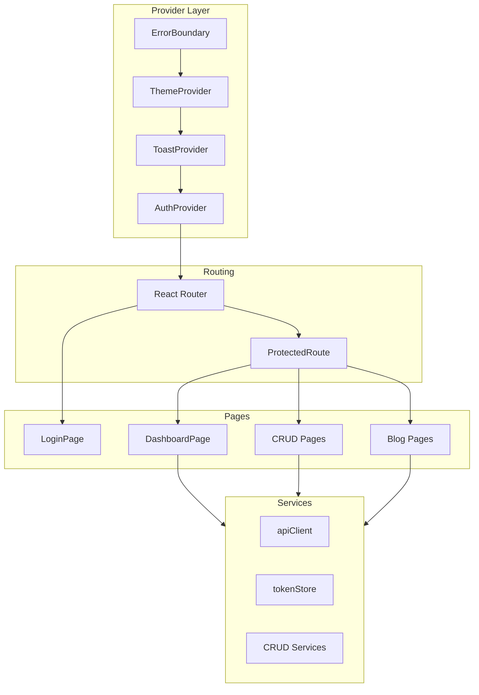

### Authentication Flow

1. **Session Restore**: `AuthProvider` calls `authService.me()` on mount
2. **Token Storage**: Access token in memory + sessionStorage, refresh token in HttpOnly cookie
3. **Token Refresh**: Automatic refresh on 401 responses with request queuing
4. **Redirect**: Unauthenticated users redirected to `/login`

### CRUD Architecture

The admin dashboard uses a generic CRUD pattern:

- **BaseCrudService**: Abstract base class for CRUD operations
- **useResource Hook**: Generic hook for data fetching and state management
- **Reusable Components**: DataTable, Modal, ConfirmDialog, FormField

## Blog Engine Architecture

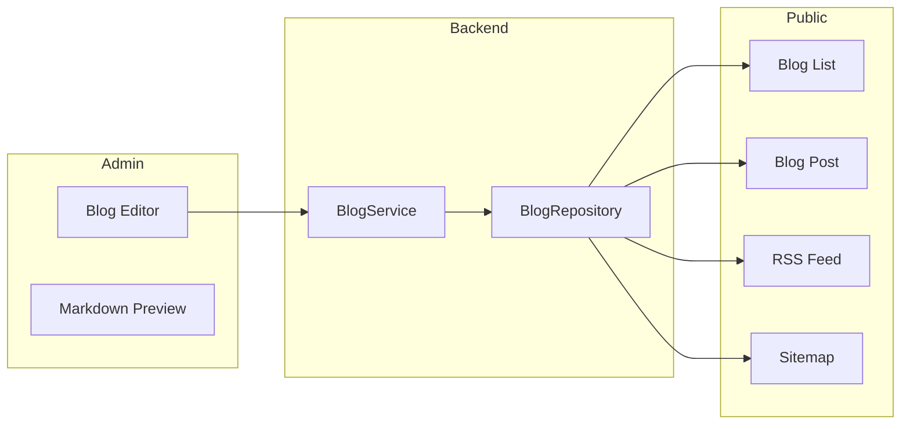

### Features

- **Markdown Support**: Write posts in Markdown with GFM extensions
- **Syntax Highlighting**: Code blocks with syntax highlighting
- **Sanitization**: HTML sanitization to prevent XSS
- **Categories & Tags**: Organize posts with categories and tags
- **Draft Workflow**: Save as draft, preview, publish when ready
- **SEO**: Automatic meta tags, Open Graph, JSON-LD structured data

## Contact System Architecture

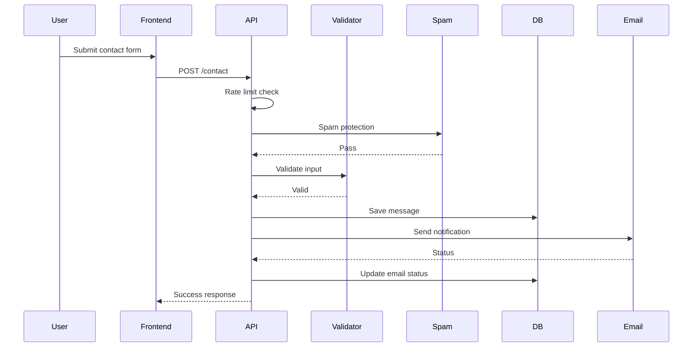

### Protection Layers

1. **Rate Limiting**: Configurable per-IP rate limit
2. **Spam Protection**: Honeypot fields and bot detection
3. **Input Validation**: Server-side validation with sanitization
4. **Email Status Tracking**: Track delivery status for each message

## Resume Management Architecture

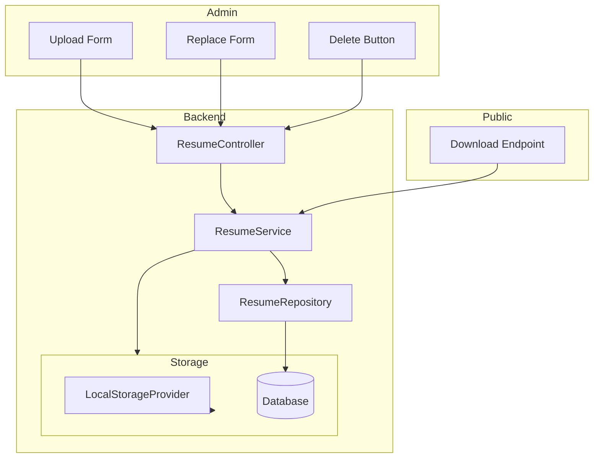

### Storage Abstraction

The `StorageService` provides a pluggable storage interface:

```javascript
interface StorageProvider {
  init(): Promise<void>
  save(buffer, metadata): Promise<{ storageKey, path, url }>
  delete(storageKey): Promise<void>
  getStream(storageKey): Promise<ReadableStream>
}
```

Currently implemented: `LocalStorageProvider` (file system)

## Analytics System

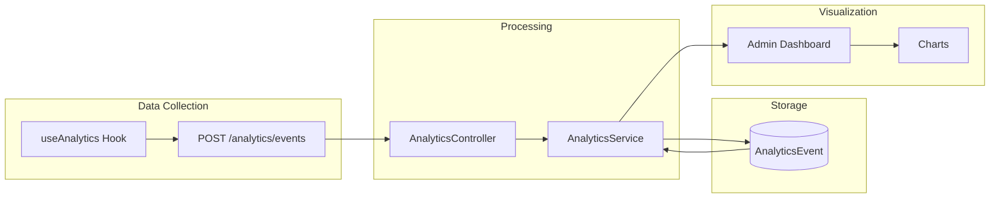

### Privacy Features

- **No Third-Party Scripts**: All analytics are first-party
- **Visitor Hashing**: Daily-salted SHA-256 of IP + User-Agent
- **Bot Filtering**: Known crawler patterns are dropped
- **Data Retention**: Automatic cleanup after configurable retention period
- **Aggregated Data Only**: Admin dashboard shows aggregated metrics only

## SEO Architecture

### Meta Tag System

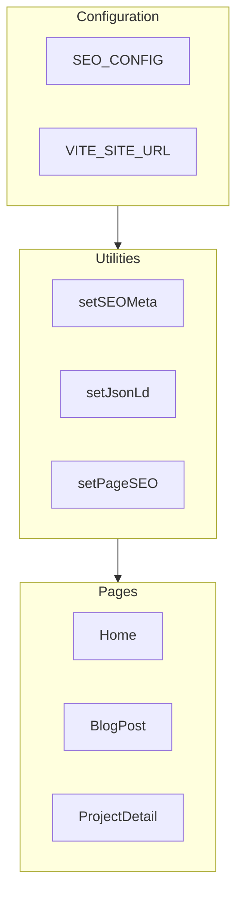

### Structured Data Types

- **Person**: Profile information
- **WebSite**: Site metadata with SearchAction
- **BlogPosting**: Blog post structured data
- **SoftwareApplication**: Project structured data
- **BreadcrumbList**: Navigation breadcrumbs

### Dynamic Sitemap

Generated server-side at `/sitemap.xml`:
- All static pages
- Project detail pages (non-deleted)
- Published blog posts
- Blog category/tag pages (with published posts)

## Performance Architecture

### Bundle Optimization

| Optimization | Implementation |
|--------------|----------------|
| Code Splitting | React.lazy for ProjectDetailPage, BlogPost |
| Manual Chunks | Markdown dependencies in separate chunk |
| Tree Shaking | Vite/Rollup tree shaking |
| Minification | Production minification |

### Caching Strategy

| Layer | Implementation | TTL |
|-------|----------------|-----|
| Frontend | In-memory GET cache | 30 seconds |
| Backend | Cache-Control headers | 300-3600 seconds |
| Browser | HTTP cache headers | Varies by endpoint |

### Image Optimization

- **Above-the-fold**: `loading="eager"` + `fetchPriority="high"`
- **Below-the-fold**: `loading="lazy"`
- **All images**: `decoding="async"`, explicit dimensions, `aspect-ratio`

## Docker Architecture

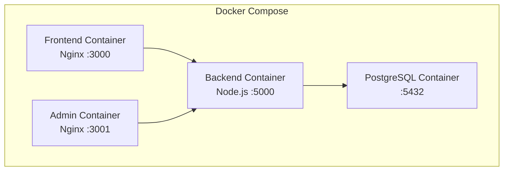

### Container Details

| Service | Image | Port | Volume |
|---------|-------|------|--------|
| frontend | nginx:1.27-alpine | 3000 | - |
| admin | nginx:1.27-alpine | 3001 | - |
| backend | node:22-alpine | 5000 | uploads |
| postgres | postgres:16-alpine | 5432 | data |

## CI/CD Pipeline

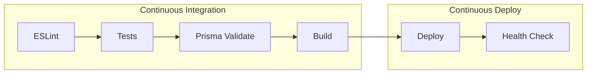

### GitHub Actions Workflow

1. **Lint**: ESLint with `--max-warnings 0`
2. **Test**: Run all test suites
3. **Prisma Validation**: Validate Prisma schema
4. **Build**: Build frontend and admin applications

## Environment Configuration

### Required Variables

| Variable | Description | Required |
|----------|-------------|----------|
| `DATABASE_URL` | PostgreSQL connection string | Yes |
| `JWT_ACCESS_SECRET` | Access token signing secret | Yes |
| `JWT_REFRESH_SECRET` | Refresh token signing secret | Yes |
| `FRONTEND_URL` | Allowed CORS origins | Production |

### Optional Variables

| Variable | Default | Description |
|----------|---------|-------------|
| `PORT` | 5000 | Backend server port |
| `NODE_ENV` | development | Environment |
| `API_PREFIX` | /api/v1 | API base path |
| `COOKIE_SECURE` | false | Secure cookie flag |
| `STORAGE_MAX_SIZE_BYTES` | 5242880 | Max upload size |

## Folder Structure

```
portfolio/
├── frontend/                 # Public React website
├── admin/                    # Admin dashboard
├── backend/                  # Express API
├── docs/                     # Documentation
├── .github/                  # GitHub Actions
├── docker-compose.yml        # Docker configuration
└── package.json              # Root scripts
```

## Conventions

- **JavaScript** (ESM) throughout — no TypeScript.
- **Prettier** for formatting, **ESLint** for linting (both run with
  `--max-warnings 0`).
- **Consistent naming** — plural resource names, `camelCase` identifiers,
  PascalCase for classes/components/React files.
- **No commented-out code**; dead code is removed.
- Each app owns its `package.json` and dependencies; the root scripts delegate
  using `--prefix`.

## SEO Architecture (Phase 14)

The portfolio uses a **centralized SEO system** with no external SEO framework.

### Configuration

`frontend/src/config/seo.js` exports `SEO_CONFIG` with:

- `siteUrl` — derived from `VITE_SITE_URL` env var (with `window.location.origin` fallback)
- `siteName`, `siteDescription`, `authorName`, `defaultOgImage`
- `titleTemplate` — `'%s — Portfolio'` (blog posts override to `'%s — Portfolio Blog'`)

### SEO Utility

`frontend/src/utils/seo.js` provides:

- `setSEOMeta(params)` — central function that creates/updates **and removes** meta tags. Key difference from the old pattern: empty values **remove** stale tags instead of skipping them, preventing meta tag leakage between page navigations.
- `setJsonLd(id, data)` — safely injects JSON-LD with `<` and `>` escaped as `\u003c`/`\u003e` to prevent script injection.
- `removeJsonLd(id)` — removes a JSON-LD script tag.
- `setPageSEO(params)` — convenience wrapper with sensible defaults.

### Page-level SEO

Each page component calls `setSEOMeta` or `setPageSEO` inside a `useEffect`:

- **Home**: Person + WebSite JSON-LD, profile-driven title/description
- **About/Experience/Skills/Education/Contact/Projects**: Static titles + descriptions
- **Blog listing**: WebSite JSON-LD with SearchAction
- **BlogPost**: BlogPosting + BreadcrumbList JSON-LD (via `blogSeo.js` wrapper), `noindex` for drafts
- **CategoryPosts/TagPosts**: Dynamic titles from category/tag name
- **ProjectDetailPage**: SoftwareApplication + BreadcrumbList JSON-LD
- **NotFound**: `noindex, nofollow` robots meta, fallback title

### Sitemap (`/sitemap.xml`)

Generated server-side in `backend/src/routes/index.js`. Includes:

- All static pages (`/`, `/about`, `/experience`, `/skills`, `/projects`, `/education`, `/contact`, `/blog`)
- Project detail pages (`/projects/:slug`) — only from non-deleted projects
- Published blog posts (`/blog/:slug`) — only from PUBLISHED posts
- Blog category/tag pages — only for categories/tags that have published posts

Blog posts have zero entries when no posts are published. No draft or unpublished content appears.

### robots.txt (`/robots.txt`)

Disallows `/admin/`, `/login`, and API auth/admin routes. References the sitemap at the configured site URL.

### Environment Variables

| Variable                 | Description                                      | Default                 |
| ------------------------ | ------------------------------------------------ | ----------------------- |
| `VITE_SITE_URL`          | Public site URL for canonicals, OG URLs, JSON-LD | `http://localhost:5173` |
| `FRONTEND_URL` (backend) | Origin(s) for CORS + sitemap/robots URLs         | `http://localhost:5173` |

The production `VITE_SITE_URL` must be set to the real HTTPS domain before building.

### Performance

- `ProjectDetailPage` and `BlogPost` are **code-split** via React `lazy()` + `Suspense`
- Blog post images use `loading="eager"` (above-the-fold); project screenshots use `loading="lazy"`
- All images have explicit `width`/`height` or aspect-ratio to prevent layout shift

## Performance Architecture (Phase 15)

### Bundle Optimization

**Vite `manualChunks`**: The `react-markdown` + `rehype-highlight` + `remark-gfm` +
`rehype-sanitize` dependency group (~350 kB raw) is split into its own `markdown` chunk,
loaded on-demand only when a blog post or markdown-rendering page is visited.

**Before (single chunk)**: 579 kB JS (179 kB gzipped)
**After (split chunks)**: 210 kB initial JS (70 kB gzipped) + 348 kB markdown chunk (106 kB gzipped, lazy)

### Lazy Loading Strategy

- `ProjectDetailPage`, `BlogPost`, `CategoryPosts`, and `TagPosts` are lazy-loaded via
  `React.lazy` + `Suspense` with an accessible `LoadingState` fallback
- All images below the fold use `loading="lazy"`
- Above-the-fold hero images use `loading="eager"` + `fetchPriority="high"`
- All images include `decoding="async"` to prevent blocking the main thread
- `aspect-ratio` CSS ensures layout stability before images load

### Image Optimization

- Every `` element includes `decoding="async"`
- Above-the-fold images (Home profile, BlogPost cover) use `loading="eager"` + `fetchPriority="high"`
- Below-the-fold images use `loading="lazy"`
- Explicit `width`/`height` + `style={{ aspectRatio }}` on every image prevents CLS
- Markdown-rendered images inherit `loading="lazy"` + `decoding="async"` via `MarkdownRenderer`

### Caching Strategy

**Frontend (in-memory)**:

- `apiClient.js` implements a module-level in-memory cache for GET requests (30-second TTL)
- Duplicate in-flight requests for the same URL are deduplicated
- Cache is bypassed when an `AbortSignal` is passed (component unmount)
- POST/PUT/PATCH/DELETE automatically invalidate the entire cache

**Backend (HTTP)**:

- `cacheHeaders()` middleware sets `Cache-Control: public, max-age=N, stale-while-revalidate=60`
  on public GET endpoints (profile/projects: 600s, blog: 300s, resume: 3600s)
- Admin/authenticated routes are NOT cached
- Sitemap.xml: 3600s, RSS feed: 300s, robots.txt: 3600s

### Compression

- `compression()` middleware with Brotli enabled (when client supports it) + gzip level 6
- 1 KB threshold — small responses are not compressed
- Admin app is a separate Vite build, completely isolated from the public bundle

### React Rendering Optimizations

- `ThemeContext` value memoized with `useMemo` to prevent unnecessary re-renders
- App route transition delay reduced from 150ms to 75ms

### Core Web Vitals Considerations

- **LCP**: Above-the-fold images eager-loaded with `fetchPriority="high"`;
  initial JS bundle reduced from 579 kB to 210 kB
- **CLS**: All images have explicit dimensions + `aspect-ratio`
- **INP**: Heavy markdown library (348 kB) loaded on-demand; reduced transition delay

### Lighthouse Results

Lighthouse could not be executed in the current environment because Chrome/Lighthouse tooling
was unavailable. Performance was validated through production builds, bundle analysis, and
runtime verification.

**Verified metrics**:

- Initial JS bundle: 210 kB (70 kB gzipped) — down from 579 kB (179 kB gzipped)
- Markdown chunk: 348 kB (106 kB gzipped) — lazy-loaded only on blog pages
- CSS: 43 kB main + per-route CSS (blog: 7.2 kB, project: 4.7 kB)
- All images include `decoding="async"`, explicit dimensions, and `aspect-ratio`

**Known limitations**:

- No build-time image optimization or WebP/AVIF conversion pipeline. If images are
  hosted on Cloudinary, URL-based transformations could provide additional gains.
- In-memory frontend cache is per-session. HTTP cache headers on the backend provide
  cross-session caching at the browser/CDN level.

## Docker Architecture (Phase 17)

The application supports containerized deployment using Docker Compose for
local development and staging environments.

### Docker Services

```
Browser
   │
   ├── localhost:3000 → Frontend (Nginx)
   │                      - React + Vite production build
   │                      - Multi-stage build (Node → Nginx)
   │                      - SPA fallback for client-side routing
   │
   └── localhost:3001 → Admin (Nginx)
                          - React + Vite production build
                          - Multi-stage build (Node → Nginx)
                          - SPA fallback for client-side routing
                          │
                          ▼
                    localhost:5000 (Backend API)
                          - Express + Prisma
                          - Multi-stage build (dependencies → prisma → runtime)
                          - Runs prisma migrate deploy on startup
                          - Non-root user for security
                          │
                          ▼
                     PostgreSQL 16 (Alpine)
                          - Named volume: postgres_data
                          - Healthcheck via pg_isready
                          - Not exposed to host (container network only)
```

### Docker Files

| File                            | Description                          |
|---------------------------------|--------------------------------------|
| `frontend/Dockerfile`           | Multi-stage build for public website |
| `frontend/nginx.conf`           | Nginx config with SPA fallback       |
| `admin/Dockerfile`              | Multi-stage build for admin          |
| `admin/nginx.conf`              | Nginx config with SPA fallback       |
| `backend/Dockerfile`            | Multi-stage build for Express API    |
| `docker-compose.yml`            | Service orchestration                |
| `docker/.env.example`           | Docker environment variables         |
| `.dockerignore`                  | Root Docker ignore rules             |
| `frontend/.dockerignore`        | Frontend Docker ignore rules         |
| `admin/.dockerignore`           | Admin Docker ignore rules            |
| `backend/.dockerignore`         | Backend Docker ignore rules          |

### Container Details

#### Frontend Container

- **Base image**: `nginx:1.27-alpine` (runtime)
- **Build image**: `node:22-alpine`
- **Port**: 3000
- **Build steps**: `npm ci` → `npm run build` → copy to Nginx
- **SPA fallback**: All routes resolve to `index.html`
- **Healthcheck**: `GET /health`

#### Admin Container

- **Base image**: `nginx:1.27-alpine` (runtime)
- **Build image**: `node:22-alpine`
- **Port**: 3001
- **Build steps**: `npm ci` → `npm run build` → copy to Nginx
- **SPA fallback**: All routes resolve to `index.html`
- **Healthcheck**: `GET /health`

#### Backend Container

- **Base image**: `node:22-alpine`
- **Build stages**: dependencies → prisma → runtime
- **Port**: 5000
- **Startup**: `prisma migrate deploy` → `node src/server.js`
- **Security**: Runs as non-root user (`appuser`)
- **Healthcheck**: `GET /api/v1/health`

#### PostgreSQL Container

- **Image**: `postgres:16-alpine`
- **Volume**: `postgres_data` (persistent)
- **Healthcheck**: `pg_isready`
- **Network**: Internal only (not exposed to host by default)

### Docker Networking

All services communicate through a dedicated bridge network
(`portfolio_network`). Container-to-container communication uses service names:

| From      | To        | Hostname  |
|-----------|-----------|-----------|
| Backend   | PostgreSQL| `postgres`|
| Frontend  | Backend   | `backend` (build-time env) |
| Admin     | Backend   | `backend` (build-time env) |

Browser-facing requests use `localhost` ports as they originate from outside
the Docker network.

### Database Migrations

The backend container automatically runs migrations on startup:

```bash
npx prisma migrate deploy
```

This applies all pending migrations without creating new ones (safe for
production). The command is idempotent and safe to run repeatedly.

### Environment Variables

Docker-specific environment variables are configured in `.env` (see
`docker/.env.example`). The `VITE_API_BASE_URL` should point to the
browser-accessible backend URL (`http://localhost:5000/api/v1`), not the
internal Docker hostname.

### Persistence

- **PostgreSQL**: Named volume `postgres_data` survives `docker compose down`
- **Uploads**: Named volume `backend_uploads` for resume files
- **Removed**: Use `docker compose down -v` to erase all data

### Security Practices

- Backend runs as non-root user (`appuser`)
- Multi-stage builds exclude build tools from runtime images
- Production dependencies only in backend runtime
- No secrets in Dockerfiles or docker-compose.yml
- PostgreSQL not exposed to host by default
- Nginx security headers configured
