# Architecture

This document describes the complete architecture of the Portfolio project — a full-stack personal portfolio website with a public React frontend, an admin React dashboard, and a layered Express API backed by PostgreSQL via Prisma.

## System Overview

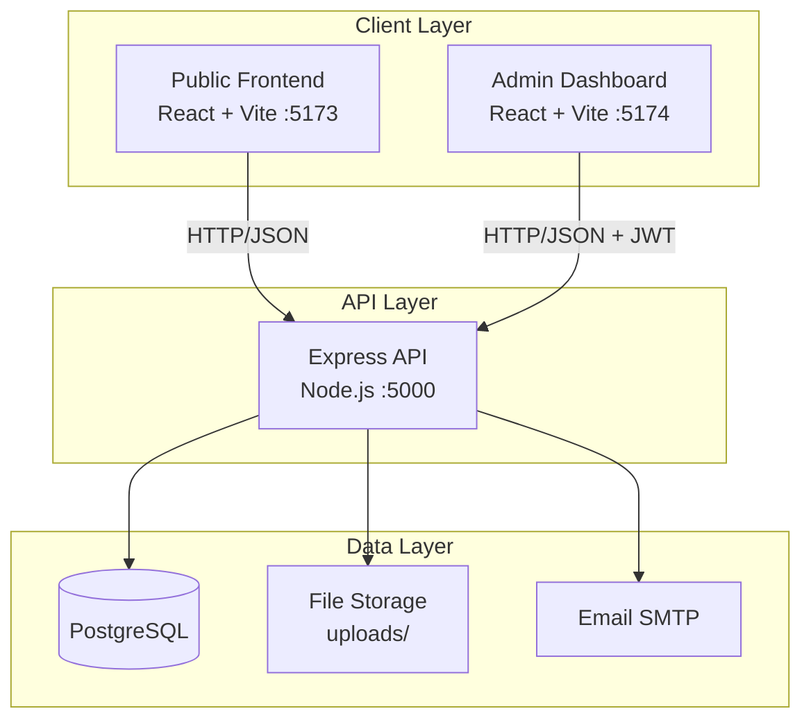

## Request Flow

### Public Request Flow

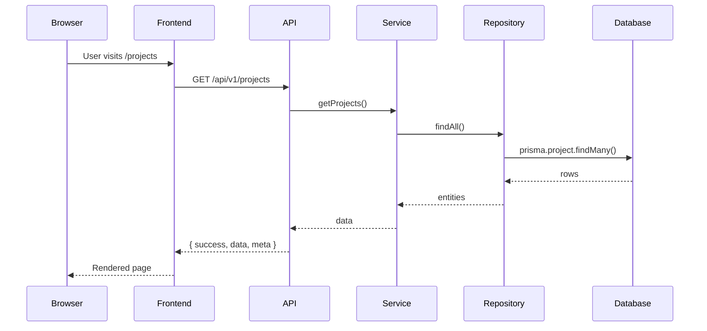

### Authenticated Admin Flow

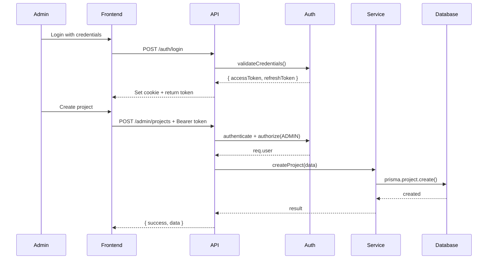

## Backend Layered Architecture

The backend follows a strict layered design. Each layer has a single responsibility and depends only on the layer below it.

```
Request
  → Middleware stack
    → Routes
      → Validators
        → Controllers
          → Services
            → Repositories
              → Database (Prisma / PostgreSQL)
```

### Layer Responsibilities

| Layer | Responsibility | Key Files |
|-------|---------------|-----------|
| `config` | Environment validation, CORS, Helmet, rate-limit | `config/env.js`, `config/cors.js` |
| `constants` | HTTP status codes, error codes, messages | `constants/*.js` |
| `middlewares` | Cross-cutting concerns | `middlewares/*.js` |
| `routes` | URL-to-handler mappings | `routes/v1/*.js` |
| `validators` | Request payload validation | `validators/*.js` |
| `controllers` | HTTP handlers, no business logic | `controllers/*.js` |
| `services` | Business logic | `services/*.js` |
| `repositories` | Data access | `repositories/*.js` |
| `storage` | File storage abstraction | `storage/*.js` |
| `utils` | Shared utilities | `utils/*.js` |

### Key Design Decisions

- **Clean separation of concerns** — Controllers never touch the database; services never read HTTP request/response objects
- **Standardized response envelope** — Every endpoint returns `{ success, message, data, meta }`
- **Centralized error handling** — Single `errorHandler` middleware converts errors into consistent JSON responses
- **Fail-fast configuration** — `config/env.js` validates required environment variables on startup
- **Versioned API** — All endpoints live under `/api/v1` for non-breaking evolution

## Authentication Flow

Authentication uses short-lived access tokens (JWT, in-memory) and long-lived refresh tokens (hashed in database, HttpOnly cookie).

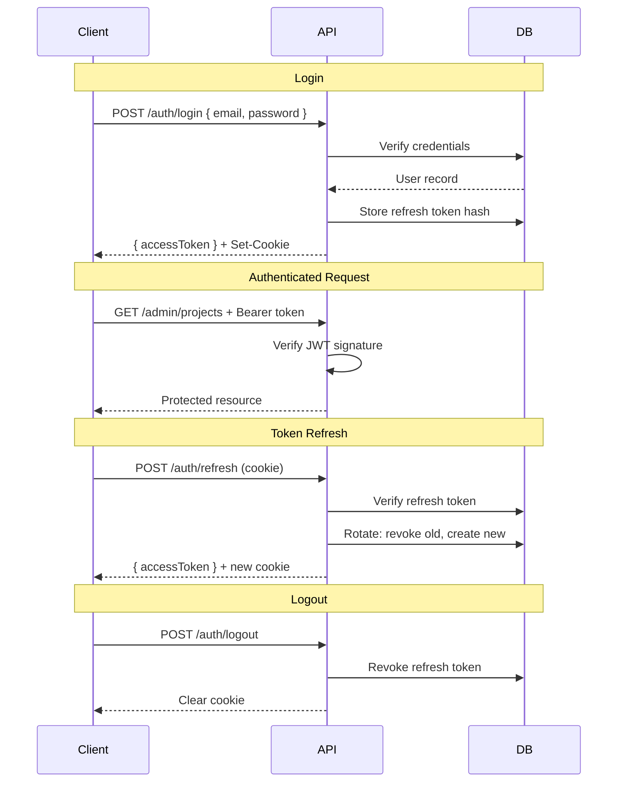

### Security Features

- **Token Rotation**: Refresh tokens are rotated on each use
- **Reuse Detection**: If a revoked token is reused, all tokens for the user are revoked
- **HttpOnly Cookies**: Refresh tokens are inaccessible to JavaScript
- **Role-Based Access**: ADMIN and EDITOR roles gate admin endpoints

## Frontend Architecture

### Public Website

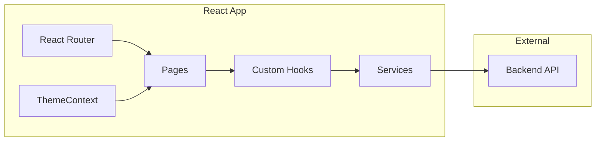

### Key Components

| Component | Purpose |
|-----------|---------|
| `apiClient.js` | HTTP client with caching, retry, timeout |
| `hooks/` | Data fetching hooks (useProjects, useBlogPosts, etc.) |
| `services/` | API service layer |
| `context/ThemeContext.jsx` | Dark/light theme management |
| `components/` | Reusable UI components |
| `pages/` | Route page components |

### Data Flow

1. **Route Change**: React Router renders the appropriate page component
2. **Data Fetching**: Page component calls a custom hook (e.g., `useProjects()`)
3. **API Call**: Hook calls service function which uses `apiClient`
4. **State Management**: Hook manages loading, error, and data state
5. **Render**: Component renders based on state

### Performance Features

- **Code Splitting**: `ProjectDetailPage` and `BlogPost` are lazy-loaded
- **Image Optimization**: Lazy loading, explicit dimensions, async decoding
- **Caching**: In-memory GET cache with 30-second TTL
- **Request Deduplication**: Duplicate in-flight requests are deduplicated

## Admin Dashboard Architecture

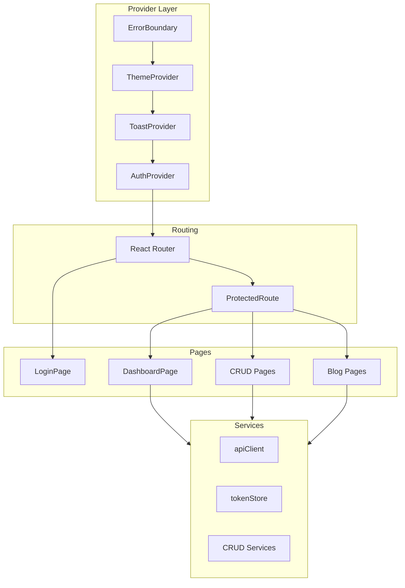

### Authentication Flow

1. **Session Restore**: `AuthProvider` calls `authService.me()` on mount
2. **Token Storage**: Access token in memory + sessionStorage, refresh token in HttpOnly cookie
3. **Token Refresh**: Automatic refresh on 401 responses with request queuing
4. **Redirect**: Unauthenticated users redirected to `/login`

### CRUD Architecture

The admin dashboard uses a generic CRUD pattern:

- **BaseCrudService**: Abstract base class for CRUD operations
- **useResource Hook**: Generic hook for data fetching and state management
- **Reusable Components**: DataTable, Modal, ConfirmDialog, FormField

## Blog Engine Architecture

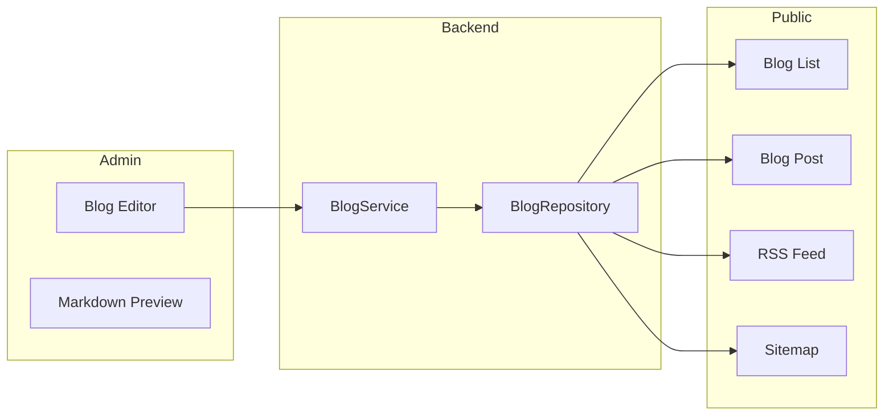

### Features

- **Markdown Support**: Write posts in Markdown with GFM extensions
- **Syntax Highlighting**: Code blocks with syntax highlighting
- **Sanitization**: HTML sanitization to prevent XSS
- **Categories & Tags**: Organize posts with categories and tags
- **Draft Workflow**: Save as draft, preview, publish when ready
- **SEO**: Automatic meta tags, Open Graph, JSON-LD structured data

## Contact System Architecture

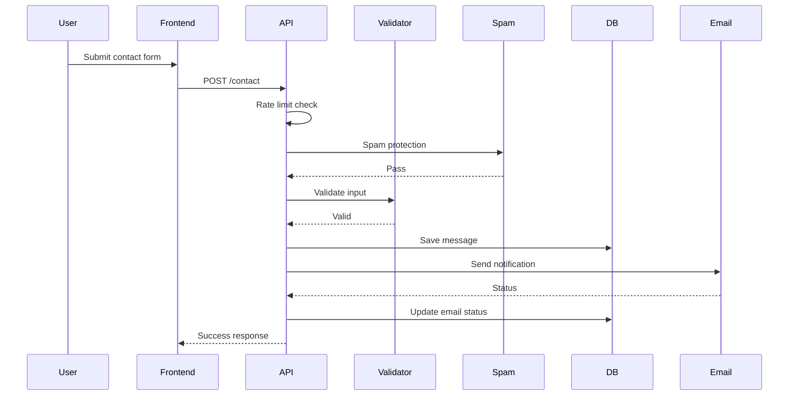

### Protection Layers

1. **Rate Limiting**: Configurable per-IP rate limit
2. **Spam Protection**: Honeypot fields and bot detection
3. **Input Validation**: Server-side validation with sanitization
4. **Email Status Tracking**: Track delivery status for each message

## Resume Management Architecture

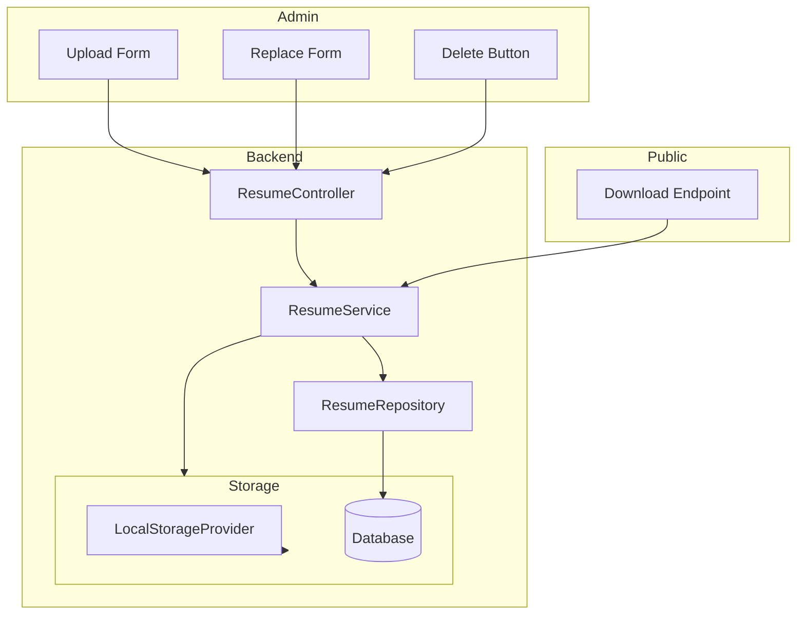

### Storage Abstraction

The `StorageService` provides a pluggable storage interface:

```javascript
interface StorageProvider {
  init(): Promise<void>
  save(buffer, metadata): Promise<{ storageKey, path, url }>
  delete(storageKey): Promise<void>
  getStream(storageKey): Promise<ReadableStream>
}
```

Currently implemented: `LocalStorageProvider` (file system)

## Analytics System

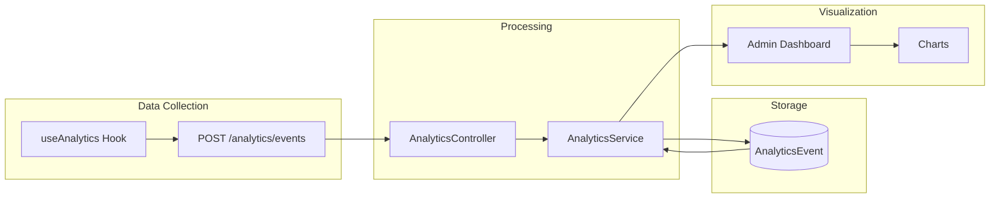

### Privacy Features

- **No Third-Party Scripts**: All analytics are first-party
- **Visitor Hashing**: Daily-salted SHA-256 of IP + User-Agent
- **Bot Filtering**: Known crawler patterns are dropped
- **Data Retention**: Automatic cleanup after configurable retention period
- **Aggregated Data Only**: Admin dashboard shows aggregated metrics only

## SEO Architecture

### Meta Tag System

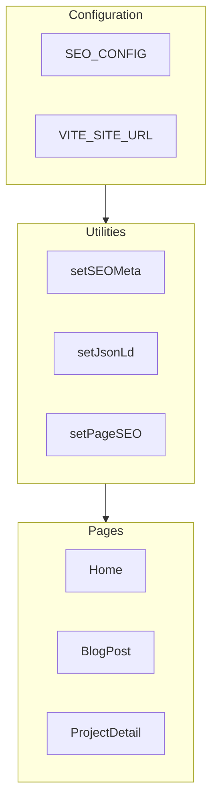

### Structured Data Types

- **Person**: Profile information
- **WebSite**: Site metadata with SearchAction
- **BlogPosting**: Blog post structured data
- **SoftwareApplication**: Project structured data
- **BreadcrumbList**: Navigation breadcrumbs

### Dynamic Sitemap

Generated server-side at `/sitemap.xml`:
- All static pages
- Project detail pages (non-deleted)
- Published blog posts
- Blog category/tag pages (with published posts)

## Performance Architecture

### Bundle Optimization

| Optimization | Implementation |
|--------------|----------------|
| Code Splitting | React.lazy for ProjectDetailPage, BlogPost |
| Manual Chunks | Markdown dependencies in separate chunk |
| Tree Shaking | Vite/Rollup tree shaking |
| Minification | Production minification |

### Caching Strategy

| Layer | Implementation | TTL |
|-------|----------------|-----|
| Frontend | In-memory GET cache | 30 seconds |
| Backend | Cache-Control headers | 300-3600 seconds |
| Browser | HTTP cache headers | Varies by endpoint |

### Image Optimization

- **Above-the-fold**: `loading="eager"` + `fetchPriority="high"`
- **Below-the-fold**: `loading="lazy"`
- **All images**: `decoding="async"`, explicit dimensions, `aspect-ratio`

## Docker Architecture

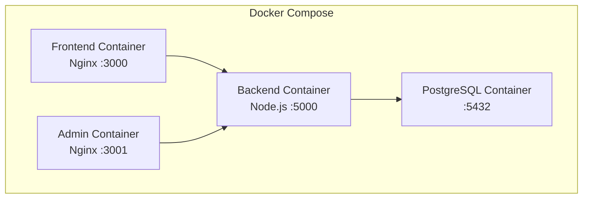

### Container Details

| Service | Image | Port | Volume |
|---------|-------|------|--------|
| frontend | nginx:1.27-alpine | 3000 | - |
| admin | nginx:1.27-alpine | 3001 | - |
| backend | node:22-alpine | 5000 | uploads |
| postgres | postgres:16-alpine | 5432 | data |

## CI/CD Pipeline

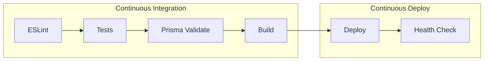

### GitHub Actions Workflow

1. **Lint**: ESLint with `--max-warnings 0`
2. **Test**: Run all test suites
3. **Prisma Validation**: Validate Prisma schema
4. **Build**: Build frontend and admin applications

## Environment Configuration

### Required Variables

| Variable | Description | Required |
|----------|-------------|----------|
| `DATABASE_URL` | PostgreSQL connection string | Yes |
| `JWT_ACCESS_SECRET` | Access token signing secret | Yes |
| `JWT_REFRESH_SECRET` | Refresh token signing secret | Yes |
| `FRONTEND_URL` | Allowed CORS origins | Production |

### Optional Variables

| Variable | Default | Description |
|----------|---------|-------------|
| `PORT` | 5000 | Backend server port |
| `NODE_ENV` | development | Environment |
| `API_PREFIX` | /api/v1 | API base path |
| `COOKIE_SECURE` | false | Secure cookie flag |
| `STORAGE_MAX_SIZE_BYTES` | 5242880 | Max upload size |

## Folder Structure

```
portfolio/
├── frontend/                 # Public React website
├── admin/                    # Admin dashboard
├── backend/                  # Express API
├── docs/                     # Documentation
├── .github/                  # GitHub Actions
├── docker-compose.yml        # Docker configuration
└── package.json              # Root scripts
```

See [docs/folder-structure.md](docs/folder-structure.md) for detailed folder documentation.
